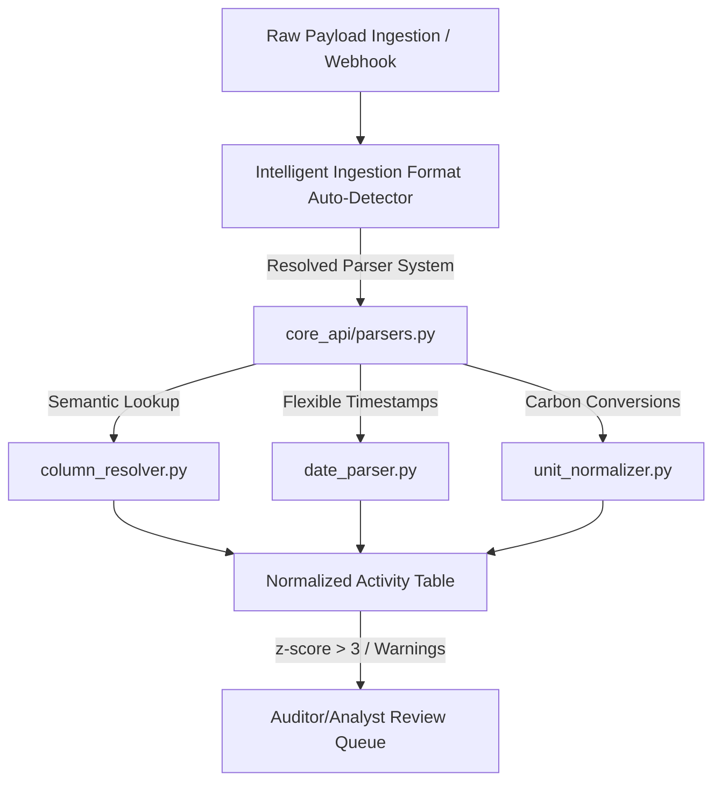

# **ESG Carbon Ledger & Data Normalization Platform**

An enterprise-grade, high-integrity environmental, social, and governance (ESG) data ingestion and carbon accounting platform. The system is designed to acquire, dynamically parse, normalize, and audit complex activity datasets representing Scope 1 (Direct Fuel), Scope 2 (Grid Electricity), and Scope 3 (Business Travel & Procurement) emissions. 

---

## **1. Architectural Overview & Normalization Engine**

Enterprise ESG analytics is fundamentally an ingestion and data alignment challenge. Telemetry originates in heterogeneous transactional systems (ERPs, utility provider billings, corporate travel platforms) with inconsistent schemas, localized headers, and temporal misalignments. The platform addresses this through a modular three-tier pipeline:

### **A. Semantic Column Resolution (`column_resolver.py`)**
* **The Problem**: Field nomenclature varies across systems. SAP exports utilize legacy German abbreviations (`BUKRS`, `WERKS`, `MATNR`, `MENGE`, `MEINS`, `BUDAT`, `BWART`), while travel vendors use various English schemas.
* **The Solution**: An intelligent semantic column detector holding **~300 standard aliases**.
  * Employs Jaro-Winkler and Levenshtein fuzzy string distance matching (requiring a confidence score > `82`).
  * Automatically maps German legacy codes and third-party headers to canonical baseline attributes before values are processed.
  * *Examples*: Maps `Buchungsdatum` to `posting_date`, `MEINS` to `unit`, and `tour_id` to `trip_id` dynamically.

### **B. Resilient Date Parser (`date_parser.py`)**
* **The Problem**: Inbound datasets contain dozens of time structures, leading to parsing crashes and incorrect default system date mappings.
* **The Solution**: A multi-format flexible date engine resolving **8 distinct time patterns**:
  1. SAP flat-file dates (`YYYYMMDD`)
  2. Microsoft OData epoch timestamps (`/Date(1498946400000)/`)
  3. German/European dot notation (`DD.MM.YYYY`)
  4. Standard ISO 8601 timestamps (with/without Z and offset parameters)
  5. Standard ISO dates (`YYYY-MM-DD`)
  6. US forward-slash grids (`MM/DD/YYYY`)
  7. Named-month English representations (`15-Apr-2025`)
  8. Standard `dateutil` fallbacks.
* **Accounting Standards**: Always converts dates to **UTC**, storing them as a chronological range (`period_start` and `period_end`) to elegantly handle non-calendar utility billing periods. Range validation checks issue non-blocking warning flags for future or excessively aged records.

### **C. Defensible Carbon Normalization (`unit_normalizer.py`)**
* **The Problem**: Converting volumetric fuel, mass spend, grid kWh, and flight distances into a single metric requires strict, defensible factors.
* **The Solution**: Domain-specific mathematical conversion handlers standardized on **`kgCO2e`** as the single unified emission baseline unit:
  * **Scope 1 (Stationary Combustion)**: Mapped using [DEFRA 2023 greenhouse gas reporting conversion factors](https://www.gov.uk/government/publications/greenhouse-gas-reporting-conversion-factors-2023). Standardizes volumetric fuel postings to Liters.
  * **Scope 2 (Purchased Electricity)**: Prorates time-series consumption (e.g. Pg&E Green Button CSVs) across calendar months. Uses localized grid factor multipliers for India (`IN`), the United Kingdom (`GB`), the United States (`US`), and Germany (`DE`).
  * **Scope 3 (Employee Business Travel)**: Mapped via IATA code registries. Calculates great-circle routes using the **Haversine formula**, applies a standard **8% distance uplift factor** for aviation detours, and weights emissions by Cabin Class factors (First, Business, Premium Economy, Economy) under [ICAO calculations methodology](https://www.icao.int/environmental-protection/CarbonOffset).

---

## **2. Core System Features & API Mechanisms**

### **A. In-Memory Thread-Safe Queue (`ESGIngestQueueWorker`)**
* To bypass Render's 512MB RAM constraints and Gunicorn's synchronous 30-second gateway timeout, the backend uses a sequential in-memory background queue:
  * File uploads return `202 Accepted` immediately, offloading the heavy openpyxl, XML, or JSON parsing to a thread-safe daemon worker.
  * Sequential queue execution guarantees that database row-locking and duplicate key insertion integrity exceptions are completely avoided.

### **B. Outlier Detection & Automated Flagging**
* Every ingestion batch dynamically calculates a **z-score statistical analysis** across processed values:
  * Any normalized activity whose emissions exceed **3 standard deviations** (`z > 3`) from the batch mean is automatically flagged as a `Statistical outlier`.
  * Rows containing validation alerts (such as travel booked by non-employees/guests, reversed credit invoices, or missing billing dates) are marked as `FLAGGED` and routed to the analyst review list before they can be locked or approved.

### **C. One-Way Immutable Audit Locks**
* For strict compliance, once an analyst approves a record, its `is_locked` parameter is set to `True`.
* This audit lock is **one-way and irreversible**—enforced at both the Django REST Framework serializer level and directly in the model's `.save()` transactional code to ensure final audited data is 100% immutable.

### **D. Schema-Free Dynamic User Assignments**
* To support assigning records to specific team members without running complex, table-locking SQL migrations, we leverage native database JSON columns (`raw_data__assigned_to`).
* Allows immediate, fluent dashboard queue slicing ("Assigned to Me" vs. "Unassigned Queue") with zero database schema alterations.

