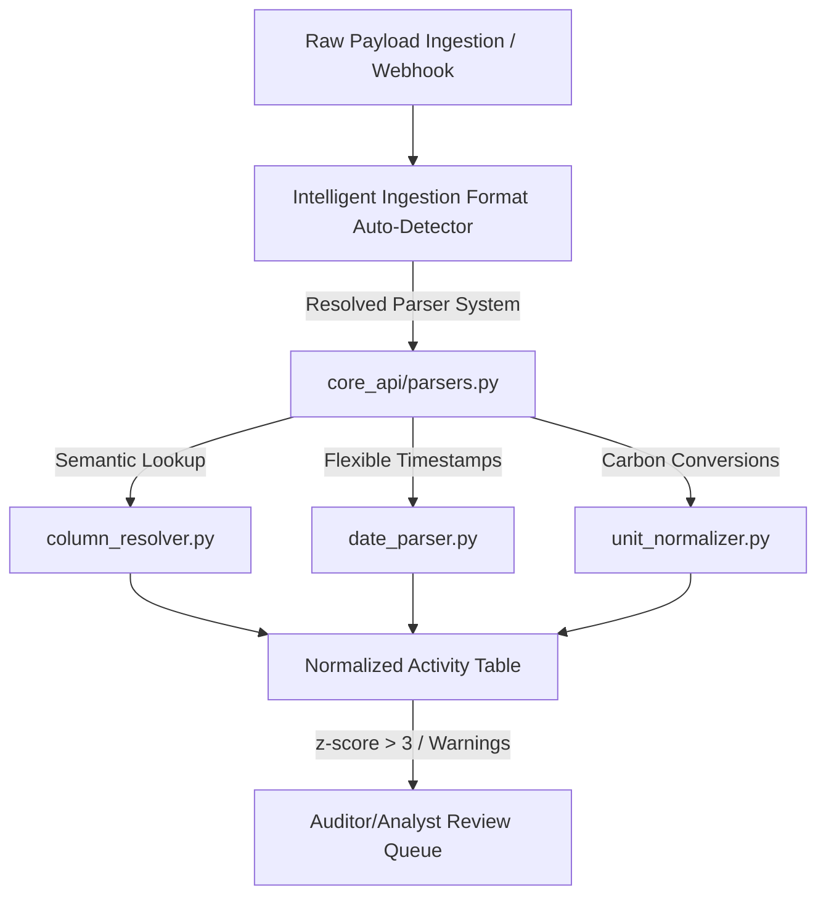

# **ESG Carbon Ledger & Data Normalization Platform**

An enterprise-grade environmental, social, and governance (ESG) data ingestion and carbon accounting platform. The system acquires, auto-detects, parses, and normalizes telemetry data representing Scope 1 (Direct Fuel), Scope 2 (Grid Electricity), and Scope 3 (Travel & Procurement) emissions into unified **kgCO2e** values strictly mapped to DEFRA 2023 guidelines.

---

## **1. Setup Guide**

### **A. Backend Setup (Django)**
```bash
# Navigate to project directory
cd esg_project

# Create and activate virtual environment
python -m venv .venv
# On Windows (PowerShell):
.\.venv\Scripts\Activate.ps1
# On macOS/Linux:
source .venv/bin/activate

# Install dependencies
pip install -r requirements.txt

# Run database migrations
python manage.py migrate

# Start the development server (runs on http://127.0.0.1:8000)
python manage.py runserver
```

### **B. Frontend Setup (React + Vite)**
```bash
# Navigate to frontend directory
cd esg_frontend

# Install dependencies
npm install

# Start the local development server (runs on http://localhost:5173)
npm run dev
```

---

## **2. Ingestion & Normalization Flow**

Enterprise ESG data originates in diverse source formats (ERP dumps, billing sheets, booking APIs) with local headers, temporal overlaps, and varied metrics. Here is how our ingestion pipeline normalizes this data:



### **Core Pipeline Services**
* **Semantic Column Mapping (`column_resolver.py`)**: Uses fuzzy matching (Levenshtein & Jaro-Winkler) to normalize heterogenous headers (like German abbreviations `MENGE`, `MEINS`, `BUDAT` or custom vendor keys) to canonical ledger terms.
* **Resilient Temporal Parsing (`date_parser.py`)**: Processes 8 different date formats (including SAP epoch `/Date(1498946400000)/`, dot-separated dates, and ISO-8601), locking inputs into absolute UTC start/end boundaries.
* **Defensible Carbon Conversions (`unit_normalizer.py`)**: Executes target emission math in unified `kgCO2e`:
  * *Scope 1*: Volumetric fuels standardized to Liters and calculated via DEFRA 2023 guidelines.
  * *Scope 2*: Prorates variable time-series utility bills across calendar months, using localized grid intensity indices.
  * *Scope 3*: Resolves 3-letter IATA airport codes to geospatial coordinates, runs the **Haversine formula**, applies a standard **8% routing uplift**, and scales calculations by Cabin Class weights.

---

## **3. How to Use the Platform**

### **Step 1: Dynamic Workspace Login**
Our system routes users dynamically to isolated organization sandboxes depending on their email domain suffix:
* **Public Domains** (e.g., `@gmail.com`, `@yahoo.com`): Automatically mapped to the shared, pre-populated **`Tata Motors`** developer workspace.
* **Corporate Domains** (e.g., `@kpmg.com`): Automatically provisions and locks the user into a fully isolated, private tenant sandbox (e.g., **`KPMG`** workspace) to prevent cross-tenant exposure.

### **Step 2: Ingesting Telemetry Data**
1. Open the UI at `http://localhost:5173` and click the **Upload Data** tab.
2. Select a sample file from the `sample_data/` directory and upload it.
3. Ingestion executes asynchronously inside our in-memory sequential queue (`ESGIngestQueueWorker`), avoiding CPU spikes and database row-lock contention. The UI refreshes with normalized metrics instantly!

---

## **4. Using the Sample Data (`sample_data/`)**

We provide pre-validated raw telemetry files in the [sample_data/](file:///c:/PROJECTSSS/esg/sample_data/) directory to demonstrate the ingestion parser capabilities:

### **A. SAP ERP (`sample_data/sap/`)**
* `sap_fuel_consumption.xlsx` — Volumetric generator diesel issues.
* `sap_material_document_odata.json` — Deep OData JSON payload representing material documents.
* `sap_mbgmcr03_idoc.xml` — Legacy XML IDocs.
* `sap_procurement.csv` / `.idoc` — German-nomenclature spreadsheets using movement keys (`101` for Scope 3 procurement, `241` for Scope 1 issues).

### **B. Utility Portals (`sample_data/utility/`)**
* `utility_electricity_IN.csv` — Time-series intervals mapped to the Indian grid carbon coefficients.
* `utility_electricity_UK.csv` — Smart-meter interval recordings utilizing the UK grid coefficients.

### **C. Corporate Travel TMC (`sample_data/travel/`)**
* `travel_concur_itinerary_v4.json` — Concur REST JSON payload detailing flight itineraries.
* `travel_navan_tmc.json` — Deep TMC travel JSON detailing active trip segments.
* `travel_corporate.csv` — Flight database logs utilizing IATA city codes.
